# 🩺 Medical RAG QA System
### Retrieval-Augmented Generation over Medical Transcription Reports

## 🚀 Overview
The **Medical RAG QA System** is a retrieval-augmented question-answering application built over a corpus of **5,000+ real-world medical transcription reports**. 

Unlike standard LLMs which may hallucinate medical facts, this system generates evidence-grounded answers using **retrieved context only**—ensuring transparency, safety, and explainability.

### 🌐 [Click Here to Try the Live Demo](https://medical-rag-app-systemgit-asvs2mfkqpo9vp6yuguptq.streamlit.app/)

---

## 🧠 Key Features

*   **🔹 Retrieval-Augmented Generation (RAG):** All answers are strictly backed by retrieved evidence—no free-form hallucination.
*   **🔹 High-Performance Embeddings:** Utilizes `sentence-transformers/all-MiniLM-L6-v2` for lightweight, accurate semantic mapping.
*   **🔹 FAISS Vector Indexing:** Enables lightning-fast nearest-neighbor search over thousands of medical text chunks.
*   **🔹 Gemini-Powered Reasoning:** Leverages **Google Gemini 2.5 Flash** for grounded, structured, and clinically relevant responses.
*   **🔹 Transparent Evidence:** Every response cites specific source chunks and metadata used to generate the answer.
*   **🔹 Interactive UI:** A clean, user-friendly Streamlit interface.

---

## 🔍 System Architecture

The pipeline follows a standard RAG workflow optimized for medical text:

```mermaid
graph TD
    A[📂 Medical Documents CSV] -->|Cleaning + Preprocessing| B(📝 Text Chunking)
    B -->|MiniLM Encoding| C[🔢 Embeddings]
    C -->|Indexing| D[(🗂️ FAISS Vector Store)]
    
    E[👤 User Question] -->|Vectorize| F(🔎 Similarity Search)
    D --> F
    F -->|Top-k Retrieved Chunks| G[📄 Context Block]
    
    G -->|Context + Prompt| H[🤖 Google Gemini 2.5 Flash]
    H --> I[✅ Evidence-Backed Answer]
```

## 🛠️ How It Works

### **1. Document Preparation**
- Clean transcription text  
- Normalize formatting  
- Chunk using `RecursiveCharacterTextSplitter`

### **2. Embedding Generation**
- MiniLM encodes chunks into dense semantic vectors

### **3. FAISS Vector Store**
- Stores embeddings  
- Enables high-speed nearest-neighbor retrieval

### **4. RAG Retrieval Flow**
1. User enters query  
2. Query is converted into an embedding  
3. FAISS retrieves the top-k relevant chunks  
4. Context block is assembled  
5. Gemini receives:  
   - Retrieved context  
   - Strict grounding instructions  
   - User question  
6. Gemini outputs a **grounded, safe answer**  
7. UI displays the answer with sources

---

## 📊 Evaluation

The system was evaluated on **30 diverse medical questions**, including:
- Pneumonia  
- COPD  
- Stroke  
- Sepsis  
- Myocardial infarction  
- Acute renal failure  
- GI bleeding  
- Post-operative complications  

### **Evaluation Focus**
- Retrieval relevance  
- Groundedness  
- Refusal behavior when lacking evidence  
- Source diversity  

### **Results**
- Very strong retrieval performance  
- Minimal hallucination  
- Consistent source transparency  

Full results available in:

`rag_eval_results.csv`

---

## 🚨 Disclaimer

This system is intended **only** for:
- Research  
- Education  
- Demonstration  

It is **NOT** a medical device.  
Do **NOT** use for diagnosis, treatment, or clinical decision-making.

---

## 👨‍💻 Technologies Used

- Python 3  
- Streamlit  
- Sentence Transformers  
- FAISS  
- LangChain Community  
- Google Gemini 2.5 Flash  
- Pandas  
- NumPy  
- Kaggle Notebook Environment  

---

## 📬 Contact

Feel free to open an issue for upgrades, contributions, or discussion.

